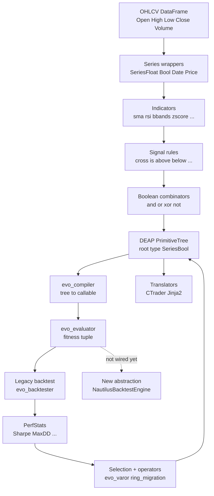
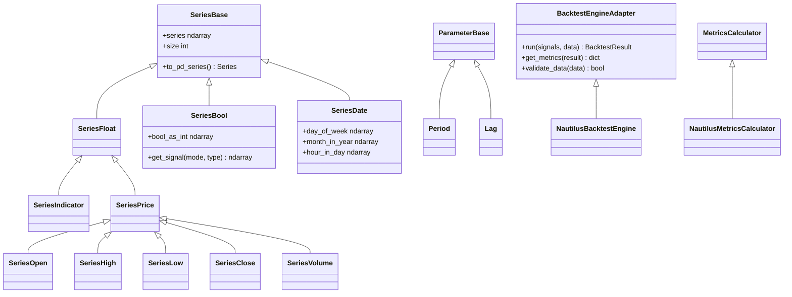
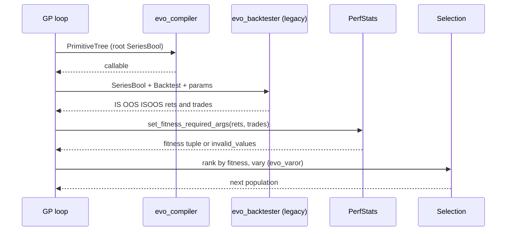

# Architecture: EvoQuant

> Living document. Verified against the current tree (post PR #6 merge, `refactor/uv`).
> Requires Python >= 3.12; install with `uv sync --all-extras --dev`
> (`--extra legacy` adds the legacy backtesting engines).
> Original decision record for the backtesting abstraction is preserved at the
> bottom; everything above it describes the system **as it exists today**.

## 1. System overview

EvoQuant evolves intraday/daily trading strategies with genetic programming
(DEAP) and evaluates them by backtesting. The intended end-to-end pipeline is:

```text
OHLCV DataFrame
  -> Series wrappers (typed: Float / Bool / Date / Price)
  -> Indicators (SeriesFloat in, SeriesFloat out)
  -> Signal rules (comparators -> SeriesBool; boolean combinators -> SeriesBool)
  -> DEAP PrimitiveTree (root type SeriesBool)
  -> compile tree -> callable -> SeriesBool
  -> Backtest engine -> trades + equity -> metrics dict
  -> selection / evolution -> repeat
  -> translate winning tree -> C# cTrader cBot source
```

Reality check: the GP-to-backtest bridge is still hard-wired to the **legacy**
`backtesting.py` engine (`evo_gp.evo_evaluator` calls `evo_backtester` from
`evo_bt.py` directly). The newer `BacktestEngineAdapter` abstraction exists and
is tested, but nothing in the evolution loop consumes it yet. There are two
parallel backtest stacks that do not interoperate (see Section 8).



## 2. Module structure

```text
src/evoquant/
├── __init__.py             # Public exports; conditional legacy EvoStrategy
├── base.py                 # Series / Parameter type system (DEAP primitive types)
├── indicators.py           # SeriesFloat -> SeriesFloat primitives + param types
├── signals.py              # Comparators (-> SeriesBool) + boolean combinators
├── evo_gp.py               # DEAP GP engine: PerfStats, evaluator, main loops
├── orchestrator.py         # STUBS ONLY: Orchestrator / Evolver unusable
├── backtest_engine/
│   ├── __init__.py         # Re-exports EvoStrategy only when legacy installed
│   ├── base.py             # BacktestEngineAdapter, BacktestConfig, BacktestResult...
│   ├── nautilus_adapter.py # Primary engine (pandas simulation, see Section 8)
│   ├── evo_bt.py           # Legacy backtesting.py adapter (needs legacy extra)
│   ├── utils.py            # Result cleaning, pulse helpers
│   └── validation.py       # Train/test + walk-forward splits (sklearn)
├── translator_engine/
│   ├── base.py             # PTTranslator + CTraderTranslator (string.Template)
│   ├── jinja_template.py   # TemplateEngine + CTraderJinjaTranslator (Jinja2)
│   ├── ctrader_template.j2 # Jinja2 C# bot template
│   └── ctrader_template.cs # Legacy $var C# template (kept alongside)
tests/                      # pytest suite (repo root, not a package)
docs/ARCHITECTURE.md        # This file
```

## 3. Type system (`base.py`)

The foundation everything else builds on. `SeriesBase` normalizes `pd.Series`
or `np.ndarray` input into an internal float/int/bool `np.ndarray`
(`to_pd_series()` converts back). Subclasses enforce dtypes:

- `SeriesFloat` (requires float64) and its children `SeriesIndicator`,
  `SeriesPrice` -> `SeriesOpen/High/Low/Close/Volume`
- `SeriesBool` (`na_value=False`; accepts bool arrays, or 0/1/NaN which are
  cast to bool). Helpers: `bool_as_int`, `get_signal("long"|"short"|"longshort",
  "int"|"str")` mapping to `{1,0,-1}` / `{"Buy","Sell","Flat"}`
- `SeriesDate` (datetime64; derives `day_of_week` 1-7, `month_in_year` 1-12,
  `hour_in_day` 0-23)
- `ParameterBase` + `Period` (int >= 5) / `Lag` (int >= 1); `str_style` 1-5
  controls code rendering (`Name=value`, `Namevalue`, `Name(value)`...),
  and `value_mapper(platform)` renders platform-specific literals
  (e.g. cTrader enums)



## 4. Indicators (`indicators.py`)

Pure functions, all `SeriesFloat -> SeriesFloat`: `shift`, `sum_indicator`,
`diff`, `abs_value`, `abs_diff`, `sma`, `highest`, `lowest`, `rsi`, `zscore`,
`bbands` (pandas-ta under the hood; `bbands` calls `ta.bbands` once per
`BBOut` selection). Indicator-local parameter types live here (not in
`base.py`): `StdDev` (float > 0), `MAMode` (`ema`/`sma` + cTrader enum map),
`BBOut` (`bbl/bbm/bbu/bbb/bbp`), plus `RSIValue`/`ZScoreValue` ephemeral
outputs. `COMPILE_RSI` / `COMPILE_ZSCORE` are raw source snippets prescribing
`pset.addPrimitive` registrations — they are never `exec`'d in-repo and only
work inside a prepared namespace. Exports use dynamic
`__all__ = list_module_contents()`.

## 5. Signals (`signals.py`)

Two-tier boolean-composition design:

- **Comparators** take `SeriesFloat`, return `SeriesBool`:
  `cross_above/below_rule`, `is_above/below_rule`, `series_*_quantile_rule`,
  `series_*_ma_rule`, `series_*_shift_rule`, `series_*_value_rule`,
  `is_incr/decr_n_bars_rule`, `is_highest/lowest_n_bars_rule`, time rules
  (`day_of_week`, `month_in_year`, `hour_in_day`, `hour_in_day_ge/le`)
- **Combinators** take only `SeriesBool`, return `SeriesBool`: `and/or/xor/not`
  plus fixed-arity composites (`and2_or1`, `and3_or2`, `or4_and3`, ... up to
  16 inputs) for building deep boolean trees GP can assemble

```text
# Every evolved strategy is a boolean expression tree like:
signal = and_rule(
    cross_above_rule(sma(close, Period(10)), sma(close, Period(20))),
    is_above_rule(rsi(close, Period(14)), SeriesFloat(threshold_array)),
)
# All leaves SeriesFloat, all internal nodes SeriesBool, root SeriesBool.
# generate_composite_signal_root() enforces boolean-only root args.
```

## 6. GP engine (`evo_gp.py`, ~1345 lines, legacy-coupled)

DEAP-based evolution. `PerfStats(*name_weight_pairs)` (e.g.
`PerfStats(("Sharpe", 1.0), ("MaxDD", -1.0))`) computes fitness over 17 metrics:
return-series metrics (`Sharpe/Calmar/Sortino/CAGR/AvgDD/Stability/Volatility/
VaR/CVaR/MaxDD/AvgDD/MaxDD_Duration`) and trade-frame metrics
(`Avg$PnL/Avg$Loss/Avg$Profit/NumberOfTrades/Total$PnL/Max$Loss`), all via
quantstats as the single metrics backend (`Stability` has no quantstats
equivalent and defaults to 0.0). Key entry points:

- `evo_compiler(expr, pset, p_context)` — tree to lambda via `eval`
- `evo_evaluator(individual, pset, pset_mapping, main_input, bt, evo_bt_params,
  perf_stats, ...)` — compile -> `SeriesBool` -> legacy `evo_backtester` ->
  `set_fitness_required_args` -> filter layers -> fitness tuple
- `gp_main_algo_random` / `gp_main_algo_standard_gp` /
  `gp_main_algo_multi_islands` (+ `ring_migration`, `evo_varor`,
  `transform_to_single_objective`)
- `evo_mutation`, `evo_cross` (string-equality retry loops)



Critical wiring gap: **no `creator.create`, no `PrimitiveSetTyped`, no
`toolbox.register("population"/"select"/"evaluate"/...)` exists anywhere in
the package** — the caller must supply a fully-wired `deap.base.Toolbox`, so
the selection operator is undefined in-repo. `evo_gp` also still types its
backtest argument as `backtesting.Backtest` and never touches the new adapter
abstraction (migration Phase 4 pending).

```text
# Fitness evaluation pseudocode (evo_evaluator):
func = evo_compiler(individual, pset, p_context)
ser_bool = func(*main_input)                       # must be SeriesBool
bt_result = evo_backtester(ser_bool, bt, **params) # {IS,OOS,ISOOS: (rets, trades)}
if not evo_filter_layer1(IS_rets, IS_trades): return perf_stats.invalid_values
check OOS + optional layer-2 filters
perf_stats.set_fitness_required_args(IS_rets, IS_trades)
return perf_stats.fitness_values                   # tuple[float, ...]
```

## 7. Backtest abstraction (`backtest_engine/base.py`)

SOLID building blocks (all real, all tested):

- `BacktestConfig` dataclass: `initial_cash=100000.0`, `commission=0.0001`,
  `slippage=0.0`, `margin=1.0`, `direction="LongOnly"`, `trade_size=0.99`,
  `stop_loss`/`take_profit` tuples or `None`, `exit_after_n_bars=None`,
  `exit_encoded_entry=True`
- `Trade` dataclass: entry/exit time+price, size, pnl, return_pct, direction,
  mae/mfe
- `BacktestResult`: `trades: list[Trade]`, `equity_curve`, `returns`, `metrics`,
  `config`, `strategy_name`; properties `is_empty`, `total_return`, `n_trades`
- `BacktestEngineAdapter` (ABC): `run(signals: pd.Series, data: pd.DataFrame,
  strategy_name="") -> BacktestResult`, `get_metrics(result) -> dict`,
  concrete `validate_data` (requires Open/High/Low/Close + DatetimeIndex);
  exposes `config` and `last_result`. **Note: there is no `get_results` and no
  `StrategyDefinition` class — the original ADR promised both, neither exists.**
- `MetricsCalculator` (ABC) and `BacktestError(message, cause=None)`

## 8. Engines: primary vs legacy

**Primary — `nautilus_adapter.py`.** `NautilusBacktestEngine.run` aligns
signals (`reindex(data.index).fillna(False).astype(bool)`), derives entries/
exits from the signal diff, and runs a hand-rolled single-position simulation
(entries/exits on `Open`, unrealized equity on `Close`, Percent stop-loss on
`Low/High`, commission deducted, fractional vs absolute `trade_size`,
`equity_curve{Equity, DrawdownPct}`). `NautilusMetricsCalculator` returns
`{Sharpe, Sortino, Calmar, MaxDrawdown, TotalReturn, WinRate, ProfitFactor}`
via quantstats with numpy fallbacks. **Despite the name, this module never
imports `nautilus_trader` — it is a bespoke pandas loop; `LongShort` direction
is a `pass` no-op; no slippage/margin/take-profit handling.**

**Legacy — `evo_bt.py`** (requires the `legacy` extra: `backtesting`,
`vectorbt`, `plotly<7.0.0` — pinned because vectorbt 1.0.0 uses
`scattermapbox`, removed in plotly 7). `EvoStrategy(backtesting.SignalStrategy)`
is configured via class attributes (`direction`, `trade_size`, `stop_loss`,
`take_profit`, `exit_after_n_bars/n_days`, `exit_end_of_week/month`, ...);
`evo_backtester(ser_bool, bt, ...)` returns `{IS, OOS, ISOOS: (rets, trades)}`
split by `linear_is_oos`/`multi_linear_is_oos`; `evo_filter_layer1/2` gate
fitness, `evo_filter_layer3` is a `None` stub. This is the engine the GP loop
actually uses.

## 9. Code translation (`translator_engine/`)

Two parallel implementations render a winning tree as a C# cTrader cBot:

- **Legacy** (`base.py`): `PTTranslator(PrimitiveTree)` partitions the tree
  (simple/composite indicator/signal lists via subtree analysis);
  `CTraderTranslator` maps terminals and registered primitives (`register_primitive`,
  `store_strat_config` with exactly 12 strategy keys) through `run_translation()`
  into `var indicatorN / signalN / root_signal` blocks, substituted into the
  `string.Template` C# `TemplateBot`
- **Jinja2** (`jinja_template.py`): `TemplateEngine` (`render_template`,
  `render_string`, `save_rendered_code`, `csharp`/`indent` filters, default
  template dir = the package directory) and `CTraderJinjaTranslator`
  rendering `ctrader_template.j2` (same bot, `{{ var }}` + `|csharp` filters).
  Note the default-params drift: Jinja defaults use `exit_encoded_entry=False`
  vs legacy `True`

```text
# Translation partitioning pseudocode (both implementations):
tree = PTTranslator(winning_primitive_tree)
for node in tree (terminals first): emit literal (OHLCV/Date name or mapped param)
for indicator in simple_indicators:   code[i] = primitive(*terminal_code)
for indicator in composite_indicators (sorted by subtree length):
                                      code[i] = primitive(*child_code)
for signal in simple_signals:         code[j] = rule(*indicator_code)
for signal in composite_signals (reversed):
                                      code[j] = combinator(*child_code)
root = composite signal covering full tree -> "root_signal"
substitute {indicator_signal_code, root_signal, **strat_config} into C# template
```

## 10. Explicit non-goals / stubs

- `orchestrator.py`: `Orchestrator.__new__` returns `None` and `Evolver` is a
  docstring plus `pass` — the orchestration layer is **unusable**; drive the
  stages directly (series -> indicators -> signals -> backtest -> translate)
- `__init__.py` export gaps: `StdDev/MAMode/BBOut` (needed for `bbands`),
  most `or*_and*` composites, time-rule and value-rule helpers,
  `BacktestResult/Trade/BacktestEngineAdapter/MetricsCalculator`,
  `NautilusMetricsCalculator`, `TemplateEngine/CTraderJinjaTranslator`, and
  everything in `evo_gp` (`PerfStats`, `evo_evaluator`, `gp_main_algo_*`) must
  be imported from their private module paths
- Dual templates (`ctrader_template.cs` `$var` vs `.j2` `{{var}}`) and dual
  translators ship side by side; the Jinja API is not re-exported from
  `translator_engine/__init__.py`

## 11. Stage-to-stage data flow (exact types)

```text
pd.DataFrame [Open,High,Low,Close,Volume, DatetimeIndex]
  -> SeriesOpen/.../Volume (SeriesFloat), SeriesDate
  -> indicators (SeriesFloat, Period|Lag|StdDev|MAMode|BBOut) -> SeriesFloat|RSI|ZScore
  -> comparators (SeriesFloat, SeriesFloat) -> SeriesBool
  -> combinators (SeriesBool, ...) -> SeriesBool
  -> gp.PrimitiveTree --str--> evo_compiler --> callable(*tuple[SeriesBase,...]) -> SeriesBool
  -> legacy: EvoStrategy.ser_bool -> Backtest.run()
       -> (._trades DataFrame, ._equity_curve{Equity,DrawdownPct})
       -> evo_backtester -> {"IS"|"OOS"|"ISOOS": (pd.Series rets, pd.DataFrame trades)}
       -> PerfStats -> tuple[float, ...]
  -> new: (pd.Series(bool), pd.DataFrame) -> NautilusBacktestEngine.run()
       -> BacktestResult{trades, equity_curve, returns, metrics}
       -> get_metrics -> dict[str,float]
  -> PTTranslator(PrimitiveTree) -> partitions -> CTraderTranslator.run_translation()
       -> generate_indicator_signal_code -> str -> get_complete_code()/generate_code -> C# str
```

## 12. Dependencies

Core (`pyproject.toml`): `deap`, `pandas`, `numpy<2.4.0`, `pandas-ta`,
`nautilus-trader` (declared but never imported — see Section 8), `quantstats`,
`statsmodels`, `scikit-learn` (OOS splits), `numba`, `jinja2`. Legacy extra:
`backtesting`, `vectorbt`, `plotly<7.0.0`. Dev: `pytest`, `pytest-cov`, `ruff`
(CI gates `ruff format --check` + `ruff check`), `mypy` (CI non-blocking).
There is no `empyrical` dependency: all performance metrics resolve through
quantstats (it was never a declared dependency; the guarded imports are removed).

## 13. Migration status (original plan vs reality)

1. ✅ Phase 1 — abstractions exist (`base.py`)
2. ⚠️ Phase 2 — adapter exists and is tested, but simulates with pandas and
   never imports `nautilus_trader`; `LongShort` unhandled
3. ✅ (isolated-ish) Phase 3 — legacy `evo_bt.py` retained behind guarded
   imports, re-exported only when installed
4. ⏳ Phase 4 — **not done**: `evo_gp` calls legacy `evo_backtester`/filters
   directly; no toolbox/pset factory added
5. ⏳ Phase 5 — **not done**: vectorbt retained via `legacy` extra
6. ⏳ Phase 6 — **not done**: dual templates/translators, export gaps,
   orchestrator stubs remain

## 14. Known defects and dead code

- `Orchestrator.__new__` returns `None`; `Evolver` is `pass` (Section 10)
- `evo_gp.evo_populator`: `executor.shutdown()` before collecting futures
- `SeriesFloat.is_stationary` references non-existent `cls._series`
- `gp_main_algo_random` no-evolution detector compares against a just-assigned
  value, never firing on first pass
- `COMPILE_RSI/ZSCORE` reference names importable only in a prepared namespace
- Commented-out CSV demos (`indicators.py`), value-rule variants
  (`signals.py`), pickle decorators with absolute Windows paths (`evo_gp.py`)
- TODOs: end-of-week/month exits, take-profit parametrization, filter layer 3,
  modular trade cleaner, Monte-Carlo/WFA validation, Point SL/TP translation

---

# Appendix: original Architecture Decision Record (historical)

## Context

The EvoQuant project used `backtesting.py` and `vectorbt` for backtesting
trading strategies. The decision was to adopt NautilusTrader while keeping the
ability to swap backtesting engines without affecting the rest of the codebase.

## Decision

An abstract backtesting engine interface was created that:

1. Defines a clear contract for any backtesting implementation
2. Allows easy swapping of backtesting engines
3. Separates concerns between strategy definition, execution, and measurement
4. Follows SOLID principles, particularly Dependency Inversion

Drift from this ADR, corrected in the sections above: the shipped interface is
`run` / `get_metrics` / `validate_data` (no `get_results`), and no
`StrategyDefinition` type was ever created — strategies travel as `SeriesBool`
signals plus `BacktestConfig`/param dicts.

## Consequences

### Positive

- ✅ Clear contracts between components (`BacktestEngineAdapter`,
  `BacktestResult`, `MetricsCalculator`)
- ✅ Legacy engines isolated behind guarded imports + `legacy` extra
- ✅ Strongly-typed GP primitives make invalid strategies unrepresentable
- ✅ Template codegen (legacy + Jinja2) from the same tree partitions

### Negative

- ⚠️ Two backtest stacks in parallel until Phase 4 lands; GP still legacy-only
- ⚠️ `NautilusBacktestEngine` is a pandas simulation, not NautilusTrader yet
- ⚠️ Export gaps force private-path imports for `evo_gp`, Jinja API, result
  types
- ⚠️ Orchestrator/Evolver stubs mean no runnable end-to-end driver exists

### Risks

- NautilusTrader results will need validation against the pandas simulation
  once a real port happens
- `plotly<7.0.0` pin is load-bearing for the `legacy` extra (vectorbt 1.0.0)
- Dynamic `__all__ = list_module_contents()` in `indicators.py`/`signals.py`
  can leak names into the public surface unintentionally

## References

- [NautilusTrader Documentation](https://nautilustrader.io/)
- [DEAP Documentation](https://deap.readthedocs.io/)
- [SOLID Principles](https://en.wikipedia.org/wiki/SOLID)
